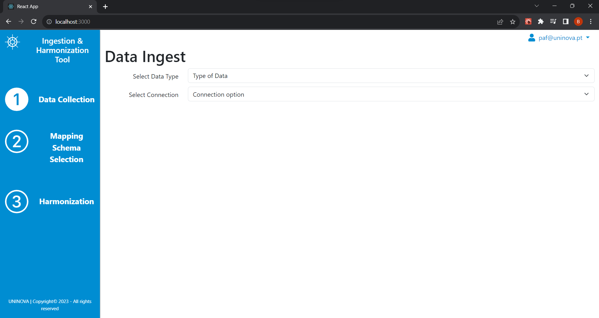
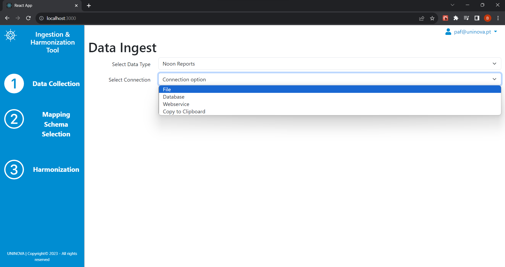
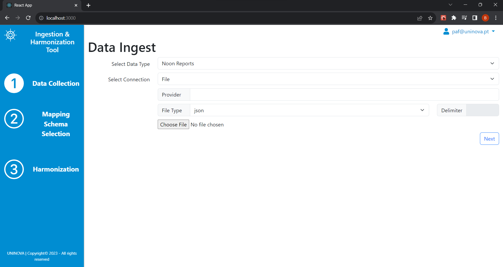
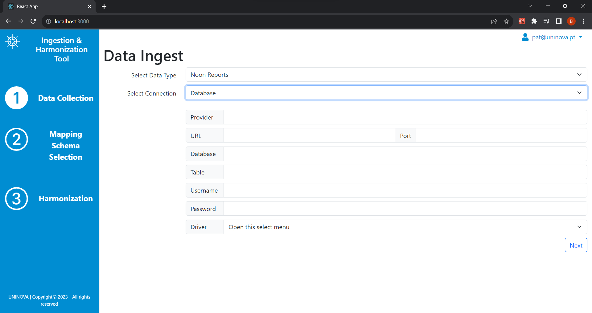
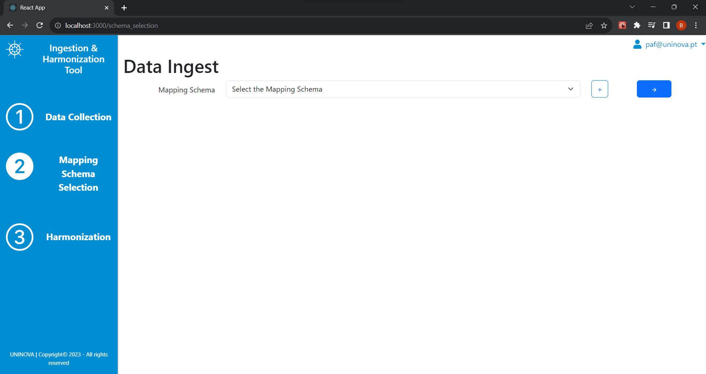
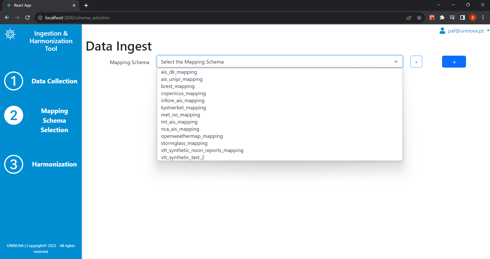
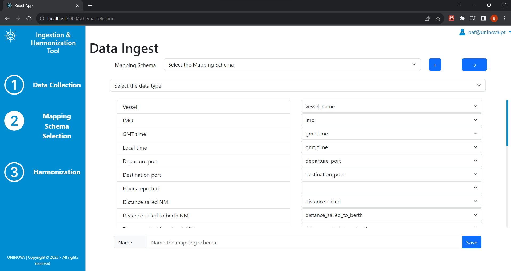
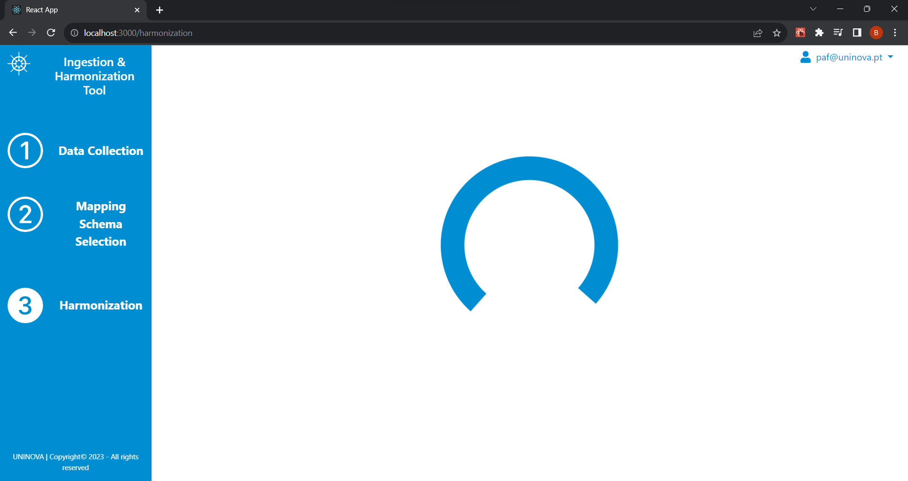
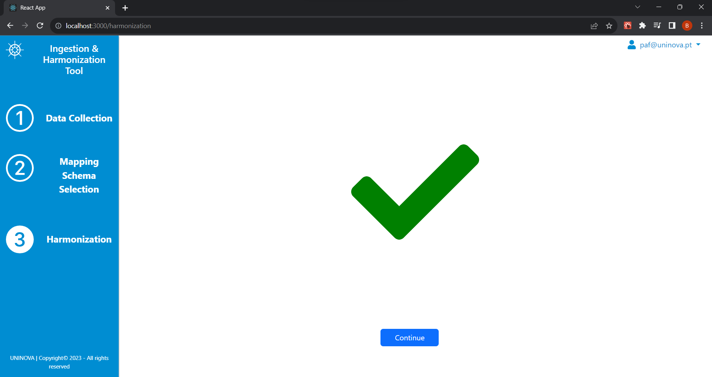

# uninova-ingestion-and-harmonisation-services_v2

The VesselAI Harmonization services enable ingestion and harmonization of weather and AIS data, delivered through the following mechanisms:
 - JSON Webservices
 - Relational Databases (MonetDB, PostGreSQL)
 - FTP and HTTP files (JSON and/or CSV)
 - Files delivered through multipart-form/data requests (JSON and/or CSV)

## Installation

To start working on the project follow the following steps:

* Ask for permissions to access the repository

* Clone the repository on your Visual Studio Code

[uninova-ingestion-and-harmonisation-services_v2 repository](https://github.com/VesselAI/uninova-ingestion-and-harmonisation-services_v2.git)

* Open a terminal

* Select the docker directory inside the working directory of the project

* Run the following command to build and run the containers
```bash
docker-compose up --build
```
* The harmonisation services are up and running, and the installation is complete

Note: the default database to store the harmonization is an instance of monetdb that is initialized in the docker-compose file, but this can be changed in the config.ini file, under the [JDBCCONFIG] parameters, or using the 'update_config' endpoint, to set a custom database.

--- 
## User Interface:
#### Main Page

Upon entering the Data Ingestion and Harmonisation Services Landing Page, the user is presented with two options to select the select the data type of the data to be ingested and harmonised, and the desired connection type, depending on which format the data will be ingested in (File, Database...).

Once the connection type is selected, new fields will open to configure the connection or, in the case that File is selected, to upload the file and configure the reading options for the file.




#### Mapping Schema Selection
After the ingestion is configured, the user proceeds to the selection of the mapping schema. 

The user can select from a list of pre-existing mapping schemas, as seen in the following picture.

However, the user also has the option to create a new mapping schema for the selected dataset. This option opens a list where the raw schema of the dataset is automatically mapped to that of the harmonised schema. This mapping can be edited by the user to change and customise the mapping schema. 

When the user is happy with the result, and the schema is named and the data type of the schema is attributed, this schema can be saved. Once saved, the schema will appear on the mapping schema list and can now be used to harmonise the data.
#### Harmonisation
After selecting the mapping schema, the user can press on the button with the right arrow to process to the harmonisation process. While the harmonisation is in progress, the page will show a loading icon.

Once the harmonisation process ends, a green checkmark will indicate to the user that the process has ended, an a continue button will appear, that takes the user to the main page of the Data Ingestion and Harmonisation Services.

---
## Endpoints:
#### POST /data/update_config

Updates the values of the default connection to the target database (the database where the harmonised data will be saved) to the values specified by the user. This way, the user can set the desired database to save the data.

__Parameters:__
 - if type = jdbc :
    - url (required)            - The URL for the database connection
    - port (required)           - The port for the database connection
    - db (required)             - The database name
    - dbtable (required)        - The database table name
    - user (required)           - The user name for authenticating with database
    - password (required)       - The user password for authenticating with the database
    - driver (required)         - The database driver (e.g. org.postgresql.com)
#### POST /data/ingest_batch

__Parameters:__

 - type (required)              - The data source/mechanism type
    - webservice                - JSON Web Service
    - database                  - Relational Database (MonetDB or PostGreSQL)
    - file-web                  - Files from FTP or HTTP (CSV or JSON)
    - file-multipart            - Files from multipart-form/data requests
 - data-type (required)         - The type of data to be ingested (Weather, AIS)
    - weather
    - ais
 - params (required)            - The internal parameters to access the data source, such as Web Services URL or FTP URL, for instance
 - mapping_schema (required)    - The name of the mapping schema for the data source
 - output_db_type               - Type of database to be used to save the harmonised data


__Possible values in "params":__
    - db_schema                 - Schema of the database where the services will store the harmonised data
    - db_table                  - Table where the user wants to save the harmonised data on the database
    
 - if type = webservice :
    - url (required)            - The Web Service's URL
    - header (optional)         - The specific header object for the webservice (a document containing the header's parameters, e.g. Content-Type, User-Agent)
    - interval (optional)       - The interval to be considered for scheduling the repeated collection of data from the web service (e.g. hours, minutes, days)
    - deltat (optional)         - The time delta to be considered with the interval (if deltat=5 and interval=hours, repeats collection every 5 hours)
 - if type = database :
    - url (required)            - The URL for the database connection
    - port (required)           - The port for the database connection
    - db (required)             - The database name
    - dbtable (required)        - The database table name
    - user (required)           - The user name for authenticating with database
    - password (required)       - The user password for authenticating with the database
    - driver (required)         - The database driver (e.g. org.postgresql.com)
 - if type = file-web :
    - file-type (required)      - The type of file - json(JSON) or csv(CSV)
    - file-url (required)       - The FTP or HTTP URL for the file
    - provider (required)       - The name of the file's provider
    - delimiter (optional)      - The file's delimiter character, in case of file-type = csv
 - if type = file-multipart :
    - file (required)           - The file, sent as a multipart-form/data file
    - file-type (required)      - The type of file - json(JSON) or csv(CSV)
    - provider (required)       - The name of the file's provider
    - delimiter (optional)      - The file's delimiter character, in case of file-type = csv
#### POST /data/ingest_stream

Currently this service collects raw data from a kafka topic, harmonizes it, stores it in a mongo db table and sends the harmonized data to a new kafka topic.

__Parameters:__
 - name                         - Name you want to give this task
 - task
    - harmonize                 - Currently only supports harmonization
 - type (required)              - The data source/mechanism type
    - file                      - file is the only supported type at the moment
 - data-type (required)         - The type of data to be ingested (Weather, AIS)
    - weather
    - ais
 - mapping_schema (required)    - The name of the mapping schema for the data source
    - brest_mapping
    - mt_ais_mapping
    - etc.
 - output_db_type               - Type of database to be used to save the harmonised data
    - mongo                        - Currently only supports mongo
 - params (required)            - The internal parameters to access the data source, such as kafka address or topic name

__Possible values in "params":__
   - provider                 - Schema of the database where the services will store the harmonised data
   - db_table                 - Table where the user wants to save the harmonised data on the database
   - broker                   - Address of the kafka broker. Uninova server:'kafka.bectr.grisenergia.pt:35066'
   - input_topic              - Name of the topic where raw data is going. Default: 'AIS_raw'
   - output_topic             - Name of the topic where the harmonized data will be sent 'AIS_harmonized'
